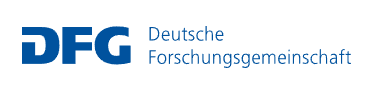

# About Voc4Cat

Voc4Cat is an example for applying *open data, open code, and open infrastructure (O3)* to create community-curated scientific resources that can outlast funding.
For more information on the *O3* idea, see [C. Hoyt and B. Gyori, 2024](https://doi.org/10.1038/s41597-024-03406-w).

```{todo} Add contributors, maintainers, citation, licence etc. - review which parts from about-guidelines and main project README.md should move here.
```

**FUNDING**



This work was funded by the German Research Foundation (DFG) through the project "[NFDI4Cat](https://nfdi4cat.org/) - NFDI for Catalysis-Related
Sciences" (DFG project no. [441926934](https://gepris.dfg.de/gepris/projekt/441926934)),
within the National Research Data Infrastructure ([NFDI](https://www.nfdi.de/)) programme of the Joint Science Conference (GWK).

**CONTACT for NFDI4Cat**


DECHEMA Gesellschaft für Chemische Technik und Biotechnologie e.V.
Theodor-Heuss-Allee 25
D–60486 Frankfurt am Main

Phone: 0049-69-7564-0
Fax: 0049-69-7564-117

Dr. Sara Espinoza

e-mail: sara.espinoza@dechema.de  
Internet: https://www.dechema.de
