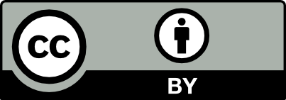

# Voc4Cat Guidelines, Version 2.0

```{note} The content in this section matches the [Vocabulary Guidelines (v2.0)](https://doi.org/10.5281/zenodo.13773255) published on Zenodo in Sept-2024. The original docx-document was converted to markdown with the help of [pandoc](https://pandoc.org/) (v3.5) using the command:

`pandoc --extract-media=. --from=docx "Voc4Cat Guidelines v2.docx" --to=commonmark --output=voc4cat-guidelines-v2.md`
```

````{admonition} Suggested citation
:class: tip

```text
Moustakas, N., Behr, A., Borgelt, H., Huskova, N., Khare, R., Talab, M.,
Köbl, J., Chandrashekhar, V., Petrenko, T., Dörr, M., & Linke, D. (2024).
Voc4Cat: Vocabulary guidelines for NFDI4Cat (2.0). Zenodo. 
https://doi.org/10.5281/zenodo.13773255
```
````

:::{dropdown} **Imprint**

**First edition: February 2023**

**Second edition: September 2024**

**LICENSE**



This guidelines document (Version 2.0) is made available under the Creative Commons Attribution 4.0 International license ([CC BY 4.0](https://creativecommons.org/licenses/by/4.0/legalcode)).
Under the terms of this license, this work may be redistributed and reused, provided that the work is appropriately cited and the creators appropriately credited.

**FUNDING**


This work was funded by the German Research Foundation (DFG) through the
project **NFDI for Catalysis-Related Sciences** ([NFDI4Cat](https://nfdi4cat.org/),
DFG-project no. [441926934](https://gepris.dfg.de/gepris/projekt/441926934)) within
the National Research Data Infrastructure ([NFDI](https://www.nfdi.de/))
programme of the Joint Science Conference (GWK).

**CONTACT**


DECHEMA Gesellschaft für Chemische Technik und Biotechnologie e.V.  
Theodor-Heuss-Allee 25  
GE – 60486 Frankfurt am Main

Phone: 0049-69-7564-0  
Fax: 0049-69-7564-117

Dr. Sara Espinoza

e-mail: sara.espinoza@dechema.de  
Internet: https://www.dechema.de

```{figure} media/nfdi4cat-partners.png
:alt: NFDI4Cat consortium members

**Figure 1. Members of the NFDI4Cat consortium.**
```

:::

## 1. About NFDI4Cat & the motivation for Voc4Cat

Catalysis is a complex and interdisciplinary scientific field that
enables the efficient production of a wide range of products for
different industries and at different production scales. Thus, catalysis
is one of the key technologies for addressing major challenges such as a
sustainable energy supply or climate change. Data management in
catalysis is currently organized mainly at an institutional or a working
group level and based on local conventions. Overarching repositories and
standards on how data including metadata should be stored exist only in
rudimentary form.

To generate the highest possible added value from catalysis research, a
fundamental change in catalysis research and catalysis-related sciences
such as chemical engineering and process engineering is required.
Bringing together the different disciplines of catalysis in terms of
data management is the central challenge. Out of this need, the NFDI4Cat
consortium was founded as part of the German *National Research Data
Infrastructure* (NFDI) initiative.

Scientific data management should follow the **FAIR** guiding
principles. This means that data are ***F**indable*, ***A**ccessible*,
***I**nteroperable* and ***R**eusable*.<sup>\[1\]</sup>

To this end, the development of shared, machine-readable vocabularies is
of utmost importance to annotate data for machine consumption and to
facilitate data reuse. In addition, such vocabulary is of great help to
build even richer semantic descriptions in a form catalysis-specific in
ontologies.

In the field of catalysis, no such vocabulary existed which motivated us
to create Voc4Cat. Since Catalysis has no borders, we created Voc4Cat as
an open, community managed resource that can be used and extended by the
international community.

NFDI4Cat consists of 16 experienced German partners from all areas of
catalysis. The disciplines of reaction and process engineering are also
represented in the consortium. The catalysis and engineering
competencies are complemented by expertise in the fields of data
science, high-performance computing, and machine learning.

**NFDI4Cat focuses on shaping the digital future of catalysis.**

## 2. Voc4Cat: A catalysis-specific vocabulary

To create shareable and interoperable (meta) data in the field of
catalysis research, the use of common machine-readable identifiers for
terms and concepts avoids disambiguation and enables understanding by
machines. This facilitates faster processing and enhances the
findability and reusability of each (meta) data set. These
machine-readable identifiers are included in field-specific
vocabularies.

A vocabulary should be:

- **Formal**: unified regularized spelling coupled with an international
  unique identifier (IRI) allowing for machine interpretability (e.g.
  concept “heterogeneous catalysis” with an IRI
  https://w3id.org/nfdi4cat/voc4cat_0007001).

- **Explicit**: strict definitions allow for a common interpretation of
  synonymously used words and concepts

- **Shared**: approved by the community and actively supported and
  curated.

**Vocabularies** form the basis of “ontologies” by defining the terms
and concepts as well as simple relations between them. The standardized
concepts having machine-readable identifiers, can in turn be used for,
*e.g.*, data annotation which increases data FAIRness. Such data are the
basis for a graph-based knowledge representation.

**Ontologies** represent knowledge explicitly in a machine-readable way
by interconnecting data *via* its properties, relations and constraints
using standardized concepts within a specific domain. Moreover,
ontologies allow logical reasoning and deriving new axioms by logical
inference. As NFID4Cat has shown existing ontologies fail short to cover
the often complex and diverse data in catalysis, emphasizing the need
for further ontology development. <sup>\[2\]</sup>

As foundation for FAIR data and to provide a basis for developing a
catalysis-specific ontology, a vocabulary dedicated for the field needs
to be established.

**Voc4Cat:**

- Is a catalysis-specific vocabulary supported by catalysis-community
  members.

- Aims at a widespread adoption and standardization of concepts and
  definitions within the catalysis community.

- Serves as the foundation for sharing machine-interoperable data within
  NFDI4Cat.

- Is managed on GitHub as a repository under the NFDI4Cat organization.

- Uses the SKOS (Simple Knowledge Organization System) Standard.

- Is released under a permissive license (CC0) and open to community
  contribution.

- Is brought to you by the members of Task Area 1 (TA1): *Ontology
  Development and Metadata Standards* of NFDI4Cat.

## 3. About the Voc4Cat guidelines

The Voc4Cat guidelines have been developed as a blueprint for
suggesting, adding, and editing content to the vocabularies developed
throughout NFDI4Cat. The aim of this document is to provide guidelines
to guarantee consistency and coherence on selection of concepts and
terms between all catalysis-related vocabularies in NFDI4Cat. The first
version of the Voc4Cat guidelines, were inspired by the AGROVOC
editorial guidelines of FAO.<sup>\[3\]</sup> This second updated version
aligns our guidelines closer to the ANSI/NISO protocol.<sup>\[4\]</sup>
The guidelines have been through excessive discussions and were evolved
over the course of *Task Area 1 (TA1): Ontology Development and Metadata
Standards* of NFDI4Cat.

## 4. Editorial group members

The editorial group of the first draft, comprises the members of the
NFDI4Cat project involved in the preparation and development of the
vocabularies in Task Area 1 (TA1): Ontology Development and Metadata
Standards. The term “Editorial Group” is used to express provenance of
self-made definitions of concepts developed within NFDI4Cat’s Task Area
1 before Voc4Cat was GitHub-hosted.

Members of the editorial group oversee the curation of Voc4Cat. A list
of active contributors and curators is available at:
[<u>https://github.com/nfdi4cat/voc4cat/graphs/contributors</u>](https://github.com/nfdi4cat/voc4cat/graphs/contributors).

> In alphabetical (based on surname) order:

<table>
<colgroup>
<col style="width: 18%" />
<col style="width: 22%" />
<col style="width: 35%" />
<col style="width: 23%" />
</colgroup>
<tbody>
<tr>
<td style="text-align: left;"><strong>Prefix</strong></td>
<td style="text-align: left;"><strong>Name</strong></td>
<td style="text-align: left;"><strong>Surname</strong></td>
<td style="text-align: left;"><strong>Affiliation</strong></td>
</tr>
<tr>
<td style="text-align: left;">M. Sc.</td>
<td style="text-align: left;">Alexander</td>
<td style="text-align: left;">Behr</td>
<td style="text-align: left;">TUDO</td>
</tr>
<tr>
<td style="text-align: left;">M. Sc.</td>
<td style="text-align: left;">Hendrik</td>
<td style="text-align: left;">Borgelt</td>
<td style="text-align: left;">TUDO</td>
</tr>
<tr>
<td style="text-align: left;">Dr.</td>
<td style="text-align: left;">Vishwas</td>
<td style="text-align: left;">Chandraskekhar</td>
<td style="text-align: left;">LIKAT</td>
</tr>
<tr>
<td style="text-align: left;">Dr.</td>
<td style="text-align: left;">Mark</td>
<td style="text-align: left;">Dörr</td>
<td style="text-align: left;">Uni Greifswald</td>
</tr>
<tr>
<td style="text-align: left;">Dr.</td>
<td style="text-align: left;">Nadiia</td>
<td style="text-align: left;">Huskova</td>
<td style="text-align: left;">HLRS</td>
</tr>
<tr>
<td style="text-align: left;">Dr.</td>
<td style="text-align: left;">Rachit</td>
<td style="text-align: left;">Khare</td>
<td style="text-align: left;">TUM</td>
</tr>
<tr>
<td style="text-align: left;"></td>
<td style="text-align: left;">Julia</td>
<td style="text-align: left;">Köbl</td>
<td style="text-align: left;">FAU</td>
</tr>
<tr>
<td style="text-align: left;">Dr.</td>
<td style="text-align: left;">David</td>
<td style="text-align: left;">Linke</td>
<td style="text-align: left;">LIKAT</td>
</tr>
<tr>
<td style="text-align: left;">Dr.</td>
<td style="text-align: left;">Nikolaos</td>
<td style="text-align: left;">Moustakas</td>
<td style="text-align: left;">LIKAT</td>
</tr>
<tr>
<td style="text-align: left;">Dr.</td>
<td style="text-align: left;">Taras</td>
<td style="text-align: left;">Petrenko</td>
<td style="text-align: left;">HLRS</td>
</tr>
<tr>
<td style="text-align: left;">M. Sc.</td>
<td style="text-align: left;">Manal</td>
<td style="text-align: left;">Talab</td>
<td style="text-align: left;">HLRS</td>
</tr>
</tbody>
</table>

> **TUDO**: Technical University of Dortmund, **LIKAT**:
> Leibniz-Institute for Catalysis, **HLRS**: High-Performance Computing
> Center Stuttgart, **TUM**: Technical University of Munich, **FAU**:
> Friedrich-Alexander-Universität Erlangen-Nürnberg, **Uni Greifswald**:
> University of Greifswald.

## 5. Contribution Step-by-Step Guide

The main steps that a community member needs to follow to contribute to
Voc4Cat are illustrated in Figure 2. Steps 1-4 are performed only once
and are intended to set up the GitHub environment for the contributor.
The actual contribution process involves steps 5-7 which are repeated
with each new submission. A more detailed (visual) guide with
screenshots can be found on Zenodo under 
[DOI:10.5281/zenodo.13757350](https://doi.org/10.5281/zenodo.13757350).

```{figure} media/contributions-steps.png
:alt: steps-of-contribution-process

**Figure 2.: Step-by Step Guide Schematic**
```

### 5.1 Step 1: Create a GitHub account

The user visits the webpage of GitHub (<https://github.com>). By
clicking on the “Sign up” button in the top right corner of the page,
the user can create a new GitHub account. GitHub is the
platform-of-choice for the curation and implementation of Voc4Cat
because of its facile discussion interface. GitHub also allows for
versioning and an easy way of tracking contributions.

*A note for experienced GitHub users who also own organizations: Forking
Voc4Cat to a GitHub organization and contributing from the organization
is not working due to GitHub limitations (status Sept-2024).*

### 5.2 Step 2: Access the Voc4Cat repository

Voc4Cat (subtitle *“A SKOS vocabulary for catalysis maintained by
NFDI4Cat & friends*) can be accessed by using the following link:
[<u>https://github.com/nfdi4cat/voc4cat</u>](https://github.com/nfdi4cat/voc4cat).
It is important to note that to be able to contribute, the user must
have already signed in with their GitHub account.

### 5.3 Step 3: Request an ID range

To be able to contribute new concepts to Voc4Cat, each user should
request their personal ID range. This ensures that multiple users can
contribute simultaneously, and it allows tracking of the *Provenance* of
each contribution. Tracking provenance allows the curators of Voc4Cat to
give credit to each individual contributor.

To request an ID range, while the user is on the Voc4Cat repository
([<u>https://github.com/nfdi4cat/voc4cat</u>](https://github.com/nfdi4cat/voc4cat)),
needs to click on *Issues* (top left corner), then on *New issue* (green
button on the top right corner) and finally click on the “*Request a
range of IDs*” option. This opens a dialog window where the user
requests a number of IDs to use for contributions. This number does not
have to be exact, so a higher number of IDs can be requested especially
if the user plans to contribute more in the future. The user can
optionally add their *Open Researcher and Contributor ID* (ORCID
identifier, [<u>https://orcid.org/</u>](https://orcid.org/)), the
*Research Organization Registry* (ROR, www.ror.org) of the organization
that they work for, and any additional information the user deems
necessary such as what his/her contributions might include. After
filling the necessary information in the dialog boxes, the user clicks
on the “*Submit new issue*” green button.

The curators will be notified about the ID request and a reply will be
shortly sent to the user with their allocated ID range. These IDs can
then be used when submitting new concepts to Voc4Cat (Step 6).

### 5.4 Step 4: Fork (copy) Voc4Cat to your own account

Copying (“*forking*”) Voc4Cat’s repository to the user’s workspace is
necessary as it allows contribution without altering the original code
but at the same time facilitates a collaborative development. This means
that various users can contribute independently by proposing their
changes to be included in the main repository. To *fork* Voc4Cat, the
user must first access the NFDI4Cat/Voc4Cat repository
([<u>https://github.com/nfdi4cat/voc4cat</u>](https://github.com/nfdi4cat/voc4cat))
while logged in, and then click on the *Fork* button (top right corner).

The “*Create a new fork*” dialog menu opens. It is advised to have the
“*Copy the main branch only*” *box ticked.* Then the user clicks on the
green “*Create fork*” button. By doing so, a copy of the Voc4Cat
repository should now exist as the user’s personal repository.

### 5.5 Step 5: Download the most recent version of Voc4Cat

Step 5 is the first of the 3 steps that need to be repeated for each
individual contribution. In this step, the user downloads the most
recent version of Voc4Cat in an .xlsx (Excel) file format. This can be
achieved either by clicking the “*Download the most current vocabulary
file (xlsx)*” link under the “Basic principles” part of the description
of Voc4Cat (or by directly using the link:
[<u>https://nfdi4cat.github.io/voc4cat/dev/voc4cat.xlsx</u>](https://nfdi4cat.github.io/voc4cat/dev/voc4cat.xlsx)).
This version of the Excel file is the one that the user should use to
edit and submit their contributions. The developed vocabulary includes a
variety of concepts and their definitions describing the most often
referenced terms in scientific journals about catalysis.

The downloaded Excel file consists of seven sheets:

1.  **Introduction**: General information regarding Voc4Cat.

2.  **Help**: A guide on how to properly fill the necessary information
    in Voc4Cat Excel sheets.

3.  **Concept Scheme**: Collects the top-level information about the
    vocabulary.

4.  **Concepts**: A concept according to SKOS is a unit of thought,
    idea, meaning, or category of an object or event which underlines a
    knowledge organization system. This sheet collects concept
    descriptions, (optionally) their translations to other languages,
    simple broader / narrower relations between the concepts and
    provenance information. This is the sheet where most edits are made.

5.  **Additional Concept Features**: This sheet allows to add more
    relations between concepts. These extra relations are adapted from
    the SKOS specification, and they include:

    1.  *Related Matches*: Mapping with this cell asserts a related or
        associated relationship to the concepts listed. It is important
        to note that this relation is not transitive (if concept A has a
        close match with concept B, and concept B has a close match with
        concept C, it doesn't necessarily follow that concept A has a
        close match with concept C).

    2.  *Close Matches*: Mapping with this cell means the concepts are
        sufficiently similar that they can be used interchangeably.
        Close matches are also not transitive.

    3.  *Exact Matches*: This is a subset of a close match. Concepts are
        to be added if they are similar enough to be used
        interchangeably but have an even higher degree of closeness that
        includes transitivity, e.g., if concept A is an exact match for
        concept B, and B is an exact match for C, then A is also an
        exact match for C.

    4.  *Broader Matches*: Broader match allows the user to assert that
        a concept is broader in meaning to another concept. This is the
        inverse of a narrower relation.

    5.  *Narrower Matches*: Narrower match allows the user to assert
        that a concept is narrower in meaning to another concept. This
        is the inverse of a broader relation.

6.  **Collections**: Collections are an easy way to group together
    concepts for various purposes. If collection rows are added to the
    sheet, all cells must be filled out.

    1.  *Preferred Label*: A simple one-line title for the *Collection*.

    2.  *Definition*: The defining description of this *Collection* that
        may be longer and include line-breaks.

    3.  *Member IRIs*: A comma-separated list of the *Concept IRIs* of
        all *Concepts* belonging to this collection.

    4.  *Provenance*: A note on the source of this *Collection*.

7.  **Prefix Sheet**: This sheet is for defining a mapping between short
    prefixes and namespaces which are the basis for using “compact URI”
    also called “CURIE”. For Voc4Cat we have registered “voc4cat” as
    prefix in the Bio Registry (bioregistry.io) and the compact URI form
    would be “voc4cat:xxxxxxx” (e.g., *voc4cat:0007001* for the concept
    “heterogeneous catalysis” with a full URI:
    *https://w3id.org/nfdi4cat/voc4cat_0007001*). For more on compact
    URIs, see
    [<u>https://www.w3.org/TR/2010/NOTE-curie-20101216/</u>](https://www.w3.org/TR/2010/NOTE-curie-20101216/).

The *Concepts* sheet is where most contributions by users will be made.
Detailed descriptions on how to properly fill these columns can be found
in paragraph 6.6. There are nine columns used in the “*Concepts*” sheet:

1. **Concept IRI**: Must be a valid URI. This is based on the
    Vocabulary URI (Uniform Resource Identifier) and for new
    contributions must align with the requested ID range.

2. **Preferred Label**: A simple one-line label for the concept.

3. **Pref. Label Language Code**: Two or three letter language code
    according to ISO 639-2 or 639-3 for the *Preferred Label*. If no
    language code is given, “en” is assumed as default (for English).

4. **Definition**: The defining description of the *Concept*.

5. **Def. Label Language Code**: Two or three letter language code
    according to ISO 639-2 or 639-3 for the *Definition*. If no language
    code is given, “en” is assumed as default (for English).
    Translations of a concept into different languages use the same IRI
    but they occupy different rows in the template. As an example, as
    shown in the following table for the “heterogenous catalysis” two
    translations of the concept name and the definition are available
    (in English -*en*- and in German -*de*-) but they both use the same
    concept URI (voc4cat:0007001).

<table>
<colgroup>
<col style="width: 20%" />
<col style="width: 18%" />
<col style="width: 12%" />
<col style="width: 33%" />
<col style="width: 13%" />
</colgroup>
<tbody>
<tr>
<td style="text-align: center;"><strong>Concept Compact
IRI</strong></td>
<td style="text-align: center;"><strong>Preferred Label</strong></td>
<td style="text-align: center;"><strong>Pref. Label Language
Code</strong></td>
<td style="text-align: center;"><strong>Definition</strong></td>
<td style="text-align: center;"><strong>Def. Language Code</strong></td>
</tr>
<tr>
<td style="text-align: center;">voc4cat:0007001</td>
<td style="text-align: center;">heterogeneous catalysis</td>
<td style="text-align: center;">en</td>
<td style="text-align: left;">A process during which a chemical reaction
is accelerated by the presence of a catalyst in a different phase than
the reactant. The reaction generally proceeds at the interface.</td>
<td style="text-align: center;">en</td>
</tr>
<tr>
<td style="text-align: center;">voc4cat:0007001</td>
<td style="text-align: center;">heterogene Katalyse</td>
<td style="text-align: center;">de</td>
<td style="text-align: left;">Ein Prozess, bei dem eine chemische
Reaktion durch das Vorhandensein eines Katalysators in einer anderen
Phase als der Reaktant beschleunigt wird. Die Reaktion findet im
Allgemeinen an der Grenzfläche statt.</td>
<td style="text-align: center;">de</td>
</tr>
</tbody>
</table>

6. **Alternate Labels**: Any other names (labels) for this *Concept*.
    Separated by commas. If the user wants to use a comma as part of the
    Alternate label, escape it with “\\ like in: “one\\two”.

7. **Children IRIs**: A list of IRIs of children of this *Concept*,
    separated by commas. This creates a hierarchical relationship
    between the terms. In SKOS terminology, the *Concept* is broader
    than its *Concept-Child* and in turn the *Concept-Child* is narrower
    than the *Concept*. Note, broader/narrower are not transitive.

8. **Provenance**: A note on the source of this concept. This should be
    an identifier for the person and a provenance note. As an
    identifier, an ORCID ID (with or without the *https://orcid.org/*
    part) or a GitHub name should be used. Multiple entries must be
    separated by comma.

9. **Source Vocab URI**: If this *Concept* is imported from another
    vocabulary, this should be the URI of the concept in the other
    vocabulary. Before including content from other sources, make sure
    that such re-use is permitted by their license.

### 5.6 Step 6: Make your contribution

In step 6, the contribution of the user in Voc4Cat takes place. For this
to happen, a set of helping guidelines have been created that should be
followed. These guidelines for suggesting, adding, and editing content
to Voc4Cat aim to guarantee consistency and coherence in the selection
and structuring of concepts, leading to a more uniform vocabulary and a
more efficient curation process.

Due to the length of the guidelines, they are detailed in a separate
chapter (Chapter 6).

### 5.7 Step 7: Submit the updated Voc4Cat in a pull request

After the user has completed all the contributions, the updated Voc4Cat
Excel file can be submitted. This submission process is called “*Pull
request*”. For this to be done, the user should access their personal
Voc4Cat copy (fork). Then by clicking on the “inbox-excel-vocabs” folder
icon, a file submission menu appears. In there the user can either drag
and drop the updated Excel file or click on the “*Add file*” button on
the top right side of the webpage.

When this step is complete, an automated Continuous Integration (CI)
pipeline is triggered. A schematic of the process is presented in Figure
4. This automated workflow allows an easy integration of contributions
from catalysis community members. The pipeline initially checks the
submitted Excel file for errors. If errors are detected, the logs are
stored as a job artifact and should be reviewed, and a fixed file should
be submitted (eventually after asking the curators for help). If no
errors occur, the submitted contribution(s) will be reviewed by the
editorial team. The contribution(s) then will be either directly merged
to Voc4Cat, rejected, or further changes will be requested before
acceptance. When feedback for further changes is received, the user can
just update the existing pull request with an improved Excel file (the
former file is present in the job artifacts produced). Updating the pull
request with a new commit will automatically restart the CI pipeline.

If the submitted contributions are evaluated positively, they will be
incorporated into Voc4Cat, and an updated version of the vocabulary will
be immediately published as an in-development version. This updated
version can be accessed by clicking on the nfdi4cat.github.io/voc4cat/
link on the right side of the main page of the NFDI4Cat/Voc4Cat GitHub
repository: a page “*Index of vocabulary versions*” loads where the
*Latest release* and *In development* version of Voc4Cat can be
accessed, as well as all previously released versions. By following any
of the aforementioned links, an HTML version of Voc4Cat opens that lists
all Collections and all concepts with their definitions and IRIs.

```{figure} media/workflow.png
:alt: GitHub contribution workflow and continuous integration pipeline

**Figure 4.: Vocabulary contribution workflow – Continuous Integration
(CI) Pipeline**
```

## 6. Guidelines for vocabulary contributors

The guidelines are aligned with the American National Standards
Institute (ANSI) / National Information Standards Organization (NISO)
Z39.19-2005 (R2010) Standard. Please note that all language dependent
parts refer to only the default language (**British English**).

### 6.1 General recommendations

#### 6.1.1 Preferred label

The *Preferred Label* of a concept refers to the primary term used to
represent a concept. It should be the most commonly used and widely
understood term. Such terms can be drawn from the catalysis-related
scientific literature. Between two or more variants of label for a
concept, the most frequently used term should be selected as the
preferred label. The remaining terms can be used as *Alternate Labels*
(see below). If the choice is not clear, opinions of experts of the
field regarding the preferred form of terms may be sought.

#### 6.1.2 Alternate label

When a concept can be expressed by two or more terms, the one(s) not
selected as the *Preferred Label* can be used as *Alternate Label(s)*.
The relationship between *Preferred Label* and *Alternate Label(s)* is
an equivalence relationship in which each label is regarded as referring
to the same concept. *Alternate Label(s)* can be e.g., synonyms (terms
whose meanings are regarded as the same or nearly the same in a wide
range of contexts), lexical or spelling variants (see below) etc.

#### 6.1.3 Spelling variants

British English spelling must be used as the spelling standard for the
development of Voc4Cat. Exceptions may be made for proper names. If
variant spellings exist and are commonly recognized, each should be
entered in Voc4Cat, one being the *Preferred Label* and the rest being
used as *Alternate Labels*. Spelling rules for English:

1.  words ending in -re/-er. Prefer -re: litre, metre;

2.  words ending in -our/-or. Prefer -our: colour;

3.  words ending in -ence/-ense. Prefer -ence (for nouns): licence;

4.  words ending in -l and followed by a suffix. Prefer -ll (not -l):
    modelling;

5.  words ending in -ize/-ise. Prefer -ize: immobilize, categorize;

6.  words ending in -yse/-yze. Prefer -yse: analyse, catalyse

#### 6.1.4 (Gender-) neutral language

(Gender-) neutral language should be used whenever possible.

#### 6.1.5 Duplicates

Duplicates of existing concepts must be avoided. *Preferred Labels*,
*Alternate Labels*, *Singular* and *Plural* forms*, hyphenation* should
also be considered when checking for the presence of duplicates.

#### 6.1.6 Definitions 

A formal explanation of the meaning of a concept. The following
considerations should be followed when adding definitions:

1.  A good definition explains what a concept is, not what it does.

2.  Only one definition per language is mandatory. The default language
    for the definitions is English.

3.  A definition is a sentence that requires orthographical rules, such
    as starting a sentence with a capital letter and ending a sentence
    with a full stop (period). The definitions need to be concise
    (ideally one sentence) and clear.

4.  A definition should implicitly explain the difference from closely
    related concepts.

5.  Circular, imprecise, or negative definitions should be avoided.

6.  A definition of a concept should not start with mentioning the
    concept that it defines.

7.  If the source of a definition is not the contributor, the use of a
    trusted and stable source should be used. Credit must be given to
    the original creator. When copyright or license is restrictive, it
    must be respected. To identify the source, a URL, or a descriptive
    source (with details of the publication) can be used.

#### 6.1.7 Things to avoid

1. Trademarked names (e.g., brand names and commercial names). Example:
    Teflon vs. polytetrafluoroethylene.

2. Names of individuals (unless as a part of the name of a method or
    technique)

3. Names of specific software or models of devices.

4. Names of policies, programs, or initiatives.

5. Neologisms, slang, and jargon. When no widely accepted alternative
    exists, the neologism, slang, or jargon term should be accepted as a
    term.

### 6.2 Single vs. multi-word (compound) terms

1. If terms are seen in both multi-word and one-word forms (e.g.,
   “thermal conductivity” vs. “thermoconductivity”), the preferred term
   should be the one-word form. The two-word form can be included as an
   *Alternate Label*.

2. Multi-word (compound) terms should express a single concept or unit
   of thought. Complex compound concepts are discouraged. It is
   recommended (if possible) to split compound words into simpler
   concepts.

3. Multi-word (compound) terms should be established as terms in the
   following circumstances:

<!-- -->

1. Splitting the parts would lead to ambiguity or a loss of meaning.

2. One component of the term is not relevant to the scope of Voc4Cat or
   is too vague to exist as an independent term.

3. The meaning of the compound term as a whole is not the sum of the
   meaning of its parts.

4. The compound term has become so familiar in common use, or in the
   field covered by Voc4Cat, that it is considered for practical
   purposes to represent a single concept.

### 6.3 Singular vs. plural

Where the singular and plural forms of a term represent different
concepts, separate terms for each should be added to Voc4Cat as
appropriate. The distinction should be indicated by a qualifier (e.g.,
Wood (material), woods (forested areas)).

#### 6.3.1 Count nouns

Concepts that are subject to the question “How many?” but not “How
much?” should normally be expressed as plurals.

#### 6.3.2 Noncount (mass) nouns 

Names of materials or substances that are subject to the question “How
much?” but not “How many?” should be expressed in the singular. If the
community of users served by Voc4Cat regards a given substance or
material as a class with more than one member, the class should be
expressed in the plural (e.g., plastics). The names of abstract
concepts, e.g., activities, properties, disciplines etc., should be
expressed in the singular, even though some of the terms are subject to
the question “How much?”.

### 6.4 Lower vs. capital letters

1.  Concepts should be written in all lower-case letters.

2.  The first letter of proper names must be a capital, when the proper
    name occurs within longer terms, such in combination with “method”,
    “theory”, or “process” (e.g., Brønsted acid site, Lewis acid site,
    Röntgen crystallography, Langmuir-Hinshelwood mechanism).

### 6.5 Grammatical forms

#### 6.5.1 Nouns

The grammatical form of a concept must be a noun or noun phrase. Noun
phrases are compound terms that may be established as terms if they
represent a single concept. When possible, noun phrases should exclude
prepositions (e.g., carbohydrate metabolism rather than metabolism of
carbohydrates). Terms in the form of prepositional noun phrases should
be restricted to concepts that cannot be expressed in any other way, or
that have become idiomatic (e.g., burden of proof, state of the art).

#### 6.5.2 Verbs

Verbs should be nominalized (transformed into nouns). Activities should
be represented by nouns or gerunds (e.g., freezing rather than freeze,
distillation rather than distill).

#### 6.5.3 Adjectives

Adjectives and adjectival phrases used alone may be established as terms
in Voc4Cat under certain special circumstances. Single adjectives may be
used in a “nominal” way; that is, the noun is obvious from the context,
or the adjective is used to describe and attribute of the concept object
other than topic, such as color or size. Certain noun phrases may be
used to modify other nouns, e.g., *high frequency* can modify the noun
*waves*. The guidelines for adjectives may be applied to such noun
phrases. Adjectives should only be used in compound terms, such as
“continuous flow”, but never alone. The use of adjectives (without a
noun), verbs, and initial articles (e.g., “A”, “An”, “The”) should be
avoided. Example: drying in an oven vs. drying in oven (prefer drying in
oven).

#### 6.5.4 Adverbs

Single adverbs are rarely used. Adverbs such as “very” or “highly”
should not be used alone as terms. A phrase beginning with such an
adverb may be accepted as a term only when it has acquired a specialized
meaning within a domain (e.g., very high frequency).

### 6.6 Typographical marks

#### 6.6.1 Hyphens

The non-hyphenated version of a concept is always preferred, unless the
hyphenated version is always the one used in literature. Both versions
of a concept (hyphenated and non-hyphenated) must be included (one of
them as an alternate label). Examples: photoexcitation vs.
photo-excitation, pretreatment vs. pre-treatment, counter electrode vs.
counter-electrode, transition metal vs. transition-metal. Hyphens should
be retained in topical terms when dropping them would lead to ambiguity.
Hyphens should be retained where they occur as part of proper nouns (see
also 7.5.1), abbreviations (see also 7.11), or chemical names (see also
7.12).

#### 6.6.2 Parentheses

Parentheses should be avoided in Voc4Cat concepts and definitions
whenever possible. Parentheses should be used only to enclose qualifiers
and trademark indicators, or when they constitute part of a term.

#### 6.6.3 Apostrophes

Apostrophes: Apostrophes generally should not be used in Voc4Cat
concepts. Two exceptions:

1. Possessive Case: Apostrophes indicating the possessive case, whether
   in a singular or plural, should be retained. The singular form is
   most frequently found in eponyms.

2. Proper names: Apostrophes that are part of proper names must be
   retained.

#### 6.6.4 Slashes

The slash (/) must be avoided (e.g., oxidation / reduction, forward /
backward reaction, working / counter electrodes) whenever possible. Two
separate concepts must be defined if the terms differ in meaning, or one
of them should be set as an *Alternate Label* if the meaning is the
same. Antonyms (concepts with opposite definitions) should be generated
into a separate concept.

### 6.7 Prepositional phrases

Prepositional phrases should be avoided (e.g., alcohol oxidation rather
than oxidation of alcohol, catalyst pretreatment rather than
pretreatment of catalyst).

### 6.8 Punctuation, diacritics, and special characters

Appropriate punctuation, diacritics and other special characters of an
individual language should be used (e.g., ü, ö, ß, ô, ñ). Examples:
Ångström, Brønsted acid sites, Röntgen crystallography. Mössbauer
effect. Symbols and punctuation marks should not be used except in
trademarks and proper names.

### 6.9 Empty spaces and commas

(Extra) empty spaces must be avoided before, within and after a term.
Commas should be avoided unless in chemical substances. Unnecessary
empty spaces could compromise search results. Examples (using `·` as space):

1. `·Semiconductor`

2. `Semiconductor·`

3. `Charge··transfer`

### 6.10 Initial articles

Initial articles in terms should be avoided except when required to
convey essential information. Remove the initial article when the term
is clear without it. If the initial article is an integral part of a
proper name, and should be searchable, it should be included in the term
in direct order.

### 6.11 Abbreviations and acronyms

1. The full form (written out) of a word / term should be generally
    selected as the preferred term. The abbreviated form or acronym
    should be included as the non-preferred label (e.g., gas
    chromatography vs. GC, density functional theory vs. DFT).

2. Abbreviations and acronyms should be selected as preferred labels of
    terms only when they have become so well established that the full
    form of the term or proper name is rarely used. In this case, the
    full form of the term should be included as an alternate label.

3. Many acronyms and abbreviations stand for more than one word or
    phrase; the full form of the term should therefore be selected as
    the term in preference to the abbreviated form, even when the
    abbreviation has only one value in the domain of Voc4Cat.

### 6.12 Chemical compounds and elements

In principle, Voc4Cat does not accept terms for chemical compounds
already defined in other controlled vocabularies (e.g., the *Chemical
Entities of Biological Interest - [ChEBI](https://www.ebi.ac.uk/chebi/)*).
In cases and if contributing to ChEBI is not an option, a chemical
compound or element is not defined elsewhere, the following guidelines
should be followed for the term to be considered for Voc4Cat:

1. Chemical compounds and elements in their full form, are written in
    lowercase, such as “carbon”, while the chemical symbol(s) is(are)
    always capitalized, such as “C”.

2. The full form is always the preferred term, whereas the symbol is
    the non-preferred term.

3. Chemical compounds and chemical elements written out are
    non-countable nouns and should be explained in the singular.

4. The definition should contain a unique identifier for chemical
    substances, such as the CAS number.

5. British English spelling is recommended, e.g., prefer aluminium (UK)
    over aluminum (USA).

### 6.13 Loanwords and translations

Loanwords are terms borrowed from the other languages that have become
naturalized in the borrowing language. If such terms are well
established in the catalysis domain, they should be admitted into
Voc4Cat. Diacritics should be included if required. In all cases where a
concept can be expressed by both a loanword and a translated equivalent,
the most widely used of the two should be used as the preferred label
and the other as an alternate label.

## 7. Voc4Cat structure: Top-Concepts

The SKOS standard does not constrain the type of hierarchy that is
expressed with the relations SKOS:broader and SKOS:narrower. While SKOS
focuses on “*Is-A*” relations (car is a vehicle) expressing part-whole
relations (tire is part of car) would also be possible. Voc4Cat is
designed as a taxonomy that organizes concepts by subject. Therefore,
the type of relations between concepts to create hierarchies are
strictly “*Is-A*” relationships and SKOS:broader and SKOS:narrower are
only used to express Is-A (but not for part-whole relations). Thus,
Voc4Cat focuses on categorizing things by what they are. Such *subject
hierarchies* with *Is-A* based hierarchies correspond well with
ontological modelling and reasoning as well as semantic search or AI
applications.

For other use cases grouping concepts by topic is valuable. For such
groupings, SKOS:collection might be used. An example for such a
collection already existing in Voc4Cat is voc*4cat:0001901*), which
collects the terms with specific relevance for the sub-discipline
photocatalysis. In Voc4Cat, SKOS:collection may be used to create such
lists or even for representing list-of-lists. In this topic-wise form of
organization part-of-relations or even looser relations (e.g.,
SKOS:related) dominate.

In Voc4Cat hierarchies are created based on “*Is-A*” relations as shown
in the following example:

- Process

  - Manufacturing Process

    - Chemical Process

      - Catalytic Process

The concepts included in Voc4Cat are structured under the following
*Top-Concepts*:

<table>
<colgroup>
<col style="width: 5%" />
<col style="width: 19%" />
<col style="width: 20%" />
<col style="width: 54%" />
</colgroup>
<tbody>
<tr>
<td style="text-align: left;"></td>
<td style="text-align: center;"><strong>Compact URI</strong></td>
<td style="text-align: center;"><strong>Top-Concept</strong></td>
<td style="text-align: center;"><strong>Definition</strong></td>
</tr>
<tr>
<td style="text-align: left;">1</td>
<td style="text-align: center;">voc4cat:0000180</td>
<td style="text-align: center;">Physical entity</td>
<td style="text-align: left;">Entity with a concrete and physical
nature.</td>
</tr>
<tr>
<td style="text-align: left;">2</td>
<td style="text-align: center;">voc4cat:0000181</td>
<td style="text-align: center;">Non-temporal abstract entity</td>
<td style="text-align: left;">Any entity that cannot be located in
space-time. E.g., mathematical entities, formal semantics elements,
regions within dimensional spaces, ideas, models.</td>
</tr>
<tr>
<td style="text-align: left;">3</td>
<td style="text-align: center;">voc4cat:0000182</td>
<td style="text-align: center;">Temporal abstract entity</td>
<td style="text-align: left;">Anything that has a temporal dimension,
whether it is an instantaneous point in time, a duration, or a sequence
of events.</td>
</tr>
<tr>
<td style="text-align: left;">3.1</td>
<td style="text-align: center;">voc4cat:0000183</td>
<td style="text-align: center;">Events</td>
<td style="text-align: left;">An occurrence or happening, marked by a
specific point in time. Events can be observed, recorded, and may have
an impact on the state of the system or entities involved.</td>
</tr>
<tr>
<td style="text-align: left;">3.2</td>
<td style="text-align: center;">voc4cat:0000184</td>
<td style="text-align: center;">Actions</td>
<td style="text-align: left;">Temporal entities that have a duration and
occur at specific points in time.</td>
</tr>
<tr>
<td style="text-align: left;">3.3</td>
<td style="text-align: center;">voc4cat:0000185</td>
<td style="text-align: center;">Processes</td>
<td style="text-align: left;">A series of temporal entities, like
actions, events, changes, or functions that are not isolated but rather
a connected sequence of activities. Processes often involve the
transformation of inputs into outputs and can be conceptualized as
workflows.</td>
</tr>
<tr>
<td style="text-align: left;">4</td>
<td style="text-align: center;">voc4cat:0000186</td>
<td style="text-align: center;">Attributes</td>
<td style="text-align: left;">A characteristic of an entity that is
intrinsic to and cannot exist without the entity. (Properties,
characteristics, qualities of things, states).</td>
</tr>
</tbody>
</table>

These top concepts are similar to those in top-level ontologies (BFO,
SIO, DOLCE), to what is proposed in ANSO/NISO Z39.19-2005 (R2010), or
what was proposed as minimal set of terms for a re-organization of
AgroVoc.

## 8. Useful links and QR codes

- **Repository**: https://github.com/nfdi4cat/voc4cat

- **Latest released version**: https://w3id.org/nfdi4cat/voc4cat

- **Latest released version (.xlsx format)**:
  https://nfdi4cat.github.io/voc4cat/dev/voc4cat.xlsx

- **Index of vocabulary versions:** https://nfdi4cat.github.io/voc4cat/

```{figure} media/referenced-in-qrcodes.png

**Figure: Services and platforms that list Voc4Cat**
```

## 9. References

1. M. D. Wilkinson et al., Sci Data 3, 160018 (2016), 331-349. [doi:10.1038/sdata.2016.18](https://doi.org/10.1038/sdata.2016.18)

2. A. S. Behr et al., *J Cheminform* 6 (2024), 16. [doi:10.1186/s13321-024-00807-2](https://doi.org/10.1186/s13321-024-00807-2)

3. FAO. 2022. The AGROVOC Editorial Guidelines 2020 – Second edition. Rome. [doi:10.4060/cb8640en](https://doi.org/10.4060/cb8640en)

4. Guidelines for the Construction, Format, and Management of Monolingual Controlled Vocabularies, ANSI/NISO Z39.19 – 2005 (R2010). [doi:10.3789/ansi.niso.z39.19-2005R2010](https://doi.org/10.3789/ansi.niso.z39.19-2005R2010)
